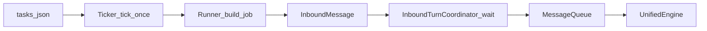

# 系统架构

> 架构概览见 [README.md §架构概览](../README.md#架构概览)。本文档为各层深读。  
> Mini Agent Python | 版本: 3.0.0 | 最后更新: 2026-07-15 | 与 `miniagent.__version__` 对齐

## 3.0 分层与 LLM 边界

3.0 在原有问答流水线之外增加显式的 provider 边界：`contracts` 定义无 SDK 的
LLM DTO/Protocol，`core` 只表达分类、澄清、规划、执行和反思，`application` 负责会话与
角色用例，`infrastructure/llm` 实现 OpenAI、Anthropic、Google 以及兼容端点，
`presentation/cli` 只消费应用事件，`bootstrap` 是唯一具体组合根。

```text
presentation / channels → application → core → contracts
              bootstrap ↘ infrastructure/llm ↗
```

`LLMGateway` 按 `default/reasoning/fast/vision` 显式角色选择 model profile，统一文本、
推理、工具、用量、取消和错误事件。模型切换和配置热更新采用不可变快照：活动回合继续持有
旧 gateway，新回合使用新 gateway，旧连接在统一关停时释放。完整配置见
[LLM_PROVIDERS.md](LLM_PROVIDERS.md)。

## 架构总览

Mini Agent Python 采用 **多阶段架构**（Phase 0 分类 → Phase 0.5 需求澄清 → Phase 1 规划 → Phase 2 执行），通过 **ReAct 循环** 实现 LLM 驱动的智能代理。系统分为 **12 个功能层**（含可选 MCP 层），支持 CLI 和飞书双通道接入，并通过 **ChannelRouter** 实现通道绑定与会话共享。

> **功能层 vs 源码子包**：本文「12 个功能层」为逻辑分层（入口、引擎、核心、记忆等）；[`README.md`](../README.md) 项目结构中的「20 个子包」为 `miniagent/` 下的物理包划分，二者维度不同。

```
                    用户输入
                 ┌────┴────┐
                CLI      飞书 WebSocket
                 └────┬────┘
                      ↓
        ┌─────── 入口层 (Entry) ──────┐
        │ __main__.py → bootstrap     │
        └─────────────┬───────────────┘
                      ↓
        ┌─────── 引擎层 (Engine) ─────┐
        │  main.py: 生命周期管理       │
        │  engine.py: UnifiedEngine   │
        │  command_dispatch.py: 命令  │
        │  message_queue: 消息调度    │
        └─────────────┬───────────────┘
                      ↓
        ┌──── 通道路由层 (Router) ────┐
        │  channel_router.py          │
        │  CLI ↔ 飞书会话绑定/解绑     │
        │  session_key 解析            │
        └─────────────┬───────────────┘
                      ↓
        ┌─────── 核心层 (Core) ───────┐
        │  Phase 0.5: requirement_clarifier.py │
        │           需求澄清（三步法）  │
        │  Phase 1: planner.py 规划   │
        │  Phase 2: executor.py 执行  │
        │  agent.py: 多阶段编排       │
        └───────┬─────┬───────────────┘
                ↓     ↓
         ┌──────┘     └──────┐
    工具层 (Tools)      记忆层 (Memory)
    exec / fs / web    store / context / index
         └──────┐     ┌──────┘
                ↓     ↓
        ┌─── 基础设施层 (Infra) ──────┐
        │  registry / monitor / logger │
        │  instance / process / loop   │
        └─────────────────────────────┘
                      ↓
        ┌─── 安全层 + 类型层 ─────────┐
        │  sandbox.py / types/*.py     │
        └─────────────────────────────┘
```

## 与 OpenClaw 的关系

- **OpenClaw**：自托管 **Gateway**，将 Discord、Telegram、飞书等多种渠道接到「口袋里的」Agent，强调多通道、会话隔离与控制中心 UI；官方文档见 [https://docs.openclaw.ai](https://docs.openclaw.ai)。
- **本仓库（Mini Agent Python）**：定位是 **Python Agent 核心**——多阶段架构（需求澄清→规划→执行）、ReAct、`ToolRegistry`、技能与 ClawHub、飞书与 CLI、本地记忆与工作空间。它**不是** OpenClaw Gateway 的等价实现，但可与同一生态（如 ClawHub 技能）对齐使用习惯。
- **可选 MCP**：`config.user.json` 中 `mcp.stdio_command` 设为 JSON 数组 `[command, arg1, ...]`（与 `stdio` 启动参数一致）；可选 `mcp.stdio_env` 为子进程环境变量对象。进程启动时在 [`engine/init.py`](../miniagent/engine/init.py) 中调用 [`register_mcp_stdio_tools`](../miniagent/mcp/runtime.py) 连接 MCP 服务端并注册 `mcp_*` 工具（`toolbox="mcp"`），随后 [`ensure_mcp_toolbox`](../miniagent/mcp/toolbox.py) 将 `mcp` 工具箱加入规划器可见列表；需安装可选依赖 `pip install miniagent-python[mcp]`。默认 `tool_selection_strategy="toolbox"` 时，规划器需在 `required_toolboxes` 中包含 `mcp` 才会向 LLM 暴露这些工具。

### 配置（JSON 格式）

- **配置层级**：`miniagent/resources/config.defaults.json`（随 wheel 发布）→ `config.user.json`（用户覆盖）。用户配置项**不支持** `MINIAGENT_*` 覆盖 defaults；运维/调试类 env 见 [ENGINEERING.md](ENGINEERING.md) §1.2。
- **敏感凭据**：API 密钥等放在 `config.user.json` 的 `secrets` 部分，由 [`env_loader.py`](../miniagent/infrastructure/env_loader.py) 桥接到 `OPENAI_API_KEY` 等 SDK 环境变量（非用户配置入口）。
- **配置加载**：[`JsonConfigLoader`](../miniagent/infrastructure/json_config.py) 统一管理；[`get_config`](../miniagent/infrastructure/json_config.py) 支持点路径访问。Internal 常量见 [`core/constants.py`](../miniagent/core/constants.py)。
- **模型传输**：`model.wire_api` 显式选择 `chat_completions`（默认）或 `responses`；`model.user_agent` 仅覆盖 SDK 的 User-Agent，不允许注入任意认证头。两种协议由统一 transport 归一化为文本、工具调用、usage、结束状态与流事件。分类、澄清、规划和反思等结构化 JSON 请求在 Responses 下从首次调用即使用流式聚合；Chat 继续使用非流式 `json_object`。
- **Responses 控制链恢复**：分类器、`llm_json` 与规划器共享状态、空响应和错误分类。第二次请求保持 reasoning 并移除采样参数；第三次分类/澄清/反思使用 low，规划使用 medium。只有 `incomplete_reason` 明确表示输出 token 耗尽时才扩大预算；确定性鉴权/模型错误不重试。分类最终降级、`llm_json` 最终异常和 planner fallback 的公开语义不变。
- **Responses 执行恢复**：执行器首次流式请求保持原参数；只有在尚未产生任何文本或工具调用时，才对网关泛化 400、429、5xx 或 completed-empty 做最多两次恢复。恢复请求移除采样参数，最后一次使用 medium；出现部分文本或工具调用后禁止自动重试，避免重复展示或重复动作。统一 transport 同时兼容仅发送 `response.output_text.done`、不发送 delta 的网关流。
- **嵌入调用**：可调用 [`create_application_container`](../miniagent/bootstrap/entrypoint.py) 构造依赖，再 `await run_runtime(container)`；调用前须加载 secrets。
- **任务难度预分类与规划可见输出**：Internal 常量 `EXECUTION_TASK_CLASSIFIER_ENABLED`（默认开启）；关闭则始终走完整规划。当 Internal 常量 `EXECUTION_ANNOUNCE_DIFFICULTY` 为真且存在 `on_thinking` 时，[`run_agent`](../miniagent/core/agent.py) 将「评估中 → 难度结论 → 执行计划」合并为**同一条**流式思考，统一 header 为 **`[评估与计划]`**；展示为精简 Markdown，完整难度/计划正文经可选关键字参数 **`full_record`** 由 [`UnifiedEngine`](../miniagent/engine/engine.py) 写入会话 `thinking` 历史。飞书侧由 `ThinkingDisplay` + `push_feishu_thinking_stream` PATCH 同一张交互卡；进入执行阶段时若 header 切换，则 **`finalize_only`** 收尾当前卡再开新段（见 [`thinking.py`](../miniagent/engine/thinking.py) / [`engine._feishu_send`](../miniagent/engine/engine.py)）。`EXECUTION_ANNOUNCE_DIFFICULTY=false`（Internal，见 `constants.py`）可关闭上述规划段推送。
- **分步执行**：Internal 常量 `PHASED_EXECUTION`（默认开启）、`STEP_MAX_TURNS`（默认 **48**）、`AGENT_MAX_TURNS`（默认 **400**，用户可在 `agent.max_turns` 覆盖）。若最后一步在单步子轮次内未以无工具回复结束，且全局轮数仍有余量，执行器会先追加一轮不传 tools 的收尾 synthesis；若全局轮数也已用尽或收尾仍异常，则返回**专用说明**。执行阶段 `on_thinking` 的合并 header 为 **`[执行]`**（单循环）或 **`[步骤 i/n]` + 描述摘要**（分步）。
- **Phase 3 反思评估**：`features.reflection` 默认开启；设为 `false` 可关闭。执行完成后，[`run_agent`](../miniagent/core/agent.py) 调用 [`reflect_on_result`](../miniagent/core/problem_solver.py) 对回复做自我反驳式审查。`on_thinking=None` 确保反思过程不产生额外的思考步骤。
- **思考深度与供应商**：[`resolve_exec_completion_kwargs`](../miniagent/core/llm_params.py) / [`resolve_planner_completion_kwargs`](../miniagent/core/llm_params.py) 合并 `model.thinking_level` / `model.thinking_budget`；DashScope/Qwen 兼容 `base_url` 时通过 [`build_thinking_extra_body`](../miniagent/core/vendor/qwen_extra.py) 注入 `extra_body`。`model.max_tokens` 覆盖输出 token 上限。

## 各层详细说明

### 1. 入口层 (Entry)

| 文件 | 职责 |
|------|------|
| `__main__.py` | 解析 CLI 参数、实例停止与诊断命令，随后调用正式应用入口 |
| `bootstrap/entrypoint.py` | 构造唯一 `ApplicationContainer` 并执行 `asyncio.run(run_runtime(container))` |
| `bootstrap/runtime_services.py` | 装配 config watcher、飞书、ticker、skills watcher 生命周期图 |
| `core/openai_client.py` | 无状态 `AsyncOpenAI` 工厂，以及显式替换、关闭应用所拥有客户端的生命周期函数 |
| `bootstrap/application.py` | `ApplicationContainer`：进程级依赖和运行期资源的唯一所有者 |
| `cli/cli.py` | 控制台脚本 `miniagent` 的入口（委托 `__main__.main`） |

### 2. 引擎层 (Engine)

运行时编排层，管理整个 Agent 生命周期。

| 文件 | 职责 |
|------|------|
| `main.py` | 进程编排：实例注册、信号、子系统初始化、生命周期启动与 `finally` 统一关停 |
| `cli_tui.py` | 全屏 CLI 公共入口、TTY/fallback 判定、视口模型与输入命令分派 |
| `cli_tui_app.py` | `_TuiApplication` owner：布局、输入、transcript、输出接线与幂等关闭 |
| `cli_tui_*` | 控件、按键、输出、历史/transcript 与单轮输入处理组件 |
| `cli_fallback.py` | 无 TTY/prompt_toolkit 时的行式 CLI，复用同一入站、出站和会话协调契约 |
| `cli_history.py` | TUI/readline 共用历史文件与会话 user 消息预加载 |
| `cli_files.py` | `@file:` / `file:` 解析、文件元数据和记忆摄取 |
| `cli_shell.py` | `!` shell 命令执行与结果格式化 |
| `engine.py` | `UnifiedEngine`：会话上下文管理、Agent 编排、思考回调、历史持久化 |
| `command_dispatch.py` | 统一命令调度器：CLI 和飞书共享 `/` 命令（支持双前缀），输出捕获（StringIO） |
| `cli_commands.py` | CLI 命令实现：/session, /instance, /queue, /help, /copy（全屏）等 |
| `background_tasks.py` | `BackgroundTaskManager`：后台任务生命周期管理、并行上限控制 |
| `btw_cmd.py` | /btw 命令实现：启动、查询、取消后台任务 |
| `doctor.py` | 环境诊断：Python 版本、依赖、配置检查 |
| `model_cmd.py` | /model 命令：查看/切换当前模型 |
| `feishu_state.py` | `FeishuRuntime`：飞书 WebSocket 长连接任务 start/stop/status |
| `session_lock.py` | 会话级锁管理：PID 存活检测、跨实例互斥 |
| `thinking.py` / `thinking_state.py` | `ThinkingDisplay` 协调 CLI/飞书展示；会话流式与 PATCH 节流状态独立持有 |
| `init.py` | 子系统初始化：技能加载、SessionManager、默认会话 |
| `welcome.py` | 欢迎界面：版本号、会话信息 |

#### 2a. 后台任务子系统 (Background Tasks)

后台任务子系统支持在主 session 中启动子 session 并行执行，不污染主对话历史。

**架构设计**：

```
主 session (CLI/飞书)
       │
       ├─ 用户输入 "/btw start <提示词>"
       │
       ↓
BackgroundTaskManager
       │
       ├─ 生成唯一 task_id (UUID[:8])
       ├─ 创建独立 session_key: __bg__<task_id>
       ├─ 构造 InboundMessage(channel="background")
       │
       ↓
asyncio.create_task(_execute_task(message))
       │
       ├─ 子 session 独立运行 Agent
       ├─ 不写入主 session history.json
       │
       ↓
TaskStatus 状态追踪
       │
       ├─ pending → running → completed/failed
       │
       ↓
用户查询结果 (/btw result <task_id>)
```

**核心类**：

| 类 | 职责 |
|----|------|
| `BackgroundTaskManager` | 任务生命周期管理、并行上限控制（max=4）、结果缓存 |
| `BackgroundTask` | 任务条目：task_id, session_key, prompt, status, result |
| `TaskStatus` | 状态枚举：pending/running/completed/failed/cancelled |

后台管理器自身负责并发上限和取消，不重复进入聊天 `MessageQueue`；Agent 执行入口消费标准 `InboundMessage`，并用 metadata 保留 parent session、task id 和空 prompt 兼容标记。

`BackgroundTaskManager` 由组合根创建并保存在 `ApplicationContainer.background_tasks`，但仅在首个任务到来时启动 TTL 清理协程。它提供独立的异步 `shutdown()`：关闭后拒绝新任务，将 pending/running 条目标记为 cancelled，取消 TTL 清理循环和全部 Agent task，并等待子 session 清理 `finally`。统一关停先停止静态服务图，再关闭该管理器与消息队列，最后关闭 Dream/embedding 等被消费者使用的资源；不存在模块级任务管理器。

**Session Isolation**：

- 后台任务使用 `__bg__<uuid>` 作为 session_key
- 完全独立于主 session，不共享历史
- 结果仅在用户主动查询时返回

**并发控制**：

- `asyncio.Lock` 保护 `_running_count`
- 达到并行上限时拒绝新任务
- 任务失败/取消时自动释放计数

**相关命令**：见 [CLI.md](CLI.md) §/btw。

### 2b. 通道路由层 (Router)

| 文件 | 职责 |
|------|------|
| `channel_router.py` | `ChannelRouter`：CLI / 飞书私聊可绑定同一主会话；群聊始终独立 |

绑定规则、典型场景、CLI 显示策略与诊断命令见 **[FEISHU.md §通道绑定](FEISHU.md#通道绑定)**（SSOT）。命令侧摘要见 [CLI.md §通道路由](CLI.md#通道路由无-bind-命令)。

### 3. 核心层 (Core)

Agent 的大脑，采用 **多阶段架构**（Phase 0.5 需求澄清 → Phase 1 规划 → Phase 2 执行）。

| 文件 | 职责 |
|------|------|
| `agent.py` | 多阶段主入口：`run_agent()` (Clarify→Plan→Execute), `run_pipeline()` (线性管线) |
| `requirement_clarifier.py` | Phase 0.5 需求澄清器：三步法（Wittgenstein→Socrates→Polanyi）将模糊输入转化为结构化需求 |
| `planner.py` | Phase 1 规划器：LLM 分析需求 → 生成 `StructuredPlan` → 本地最小路径 normalization → 选择工具箱 → 估算 tokens |
| `executor.py` | Phase 2 执行器：ReAct 循环；在 `plan.steps` 非空且 Internal 常量 `PHASED_EXECUTION` 开启时按步骤分子循环，每步单独解析 `thinking_level`/`thinking_budget` |
| `config.py` | 配置管理：`MODEL_PROFILES`, `AgentConfig` 合并, 循环检测默认值 |
| `openai_client.py` | 无状态 `AsyncOpenAI` 工厂；客户端由组合根创建、热重载原子替换、关停显式关闭 |
| `llm_params.py` | 合并规划/执行阶段的 `max_tokens`、thinking 等与供应商相关参数 |
| `llm_transport.py` | Chat Completions / Responses 双协议适配：消息与工具 schema 转换、流事件归一化、网关错误脱敏 |
| `thinking_presets.py` | 业务描述深度 → `thinking_level` 等档位映射 |
| `task_classifier.py` | 任务难度预分类（简单任务可跳过结构化规划） |
| `vendor/qwen_extra.py` | 兼容 Qwen/DashScope 时在 `extra_body` 注入 thinking 字段 |
| `self_opt/` | 自我优化子系统（详见 [SELF_OPT.md](SELF_OPT.md)） |
| `prompts/` | 系统提示词模块（详见下方 §提示词模块） |

#### 提示词模块 (prompts/)

基于 Claude 最佳实践，所有系统提示词统一管理在 `miniagent/core/prompts/` 目录下：

| 文件 | 提示词 | 用途 |
|------|--------|------|
| `identity.py` | `AGENT_IDENTITY` | Agent 核心身份、角色定位、行为规范 |
| `planner.py` | `PLAN_SYSTEM_PROMPT` | Phase 1 规划阶段：任务分解、工具箱选择 |
| `classifier.py` | `CLASSIFIER_PROMPT` | Phase 0 任务难度分类（simple/normal/medium/complex） |
| `clarifier.py` | `CLARIFIER_PROMPT` | Phase 0.5 需求澄清（三步法） |
| `reflector.py` | `REFLECTOR_PROMPT` | Phase 3 反思评估：结果质量检测 |
| `reviewer.py` | `REVIEW_PROMPT` | `/review` 命令：答案审查 |
| `improver.py` | `IMPROVE_PROMPT` | `/improve` 命令：答案改进 |
| `feishu_channel.py` | `FEISHU_CHANNEL_HINT_*` | 飞书通道工具说明 |

**结构规范**：XML 标签分层、模板与示例见 **[PROMPT_GUIDELINES.md](PROMPT_GUIDELINES.md)**（SSOT）。

#### Phase 0.5: 需求澄清（三步法）

当任务难度为 **normal / medium / complex**（非 `simple`）时，`requirement_clarifier.py` 在规划之前执行三步需求澄清。澄清器并不默认打断用户：`normal` / `medium` / `complex` 分别最多追问 1 / 2 / 3 个问题，且会先从当前请求、会话记忆、知识库和安全默认值自澄清；如果这些依据已经足够，则本轮可以追问 0 个问题。

```
用户输入 "帮我查一下天气"
        ↓
┌─── RequirementClarifier ───┐
│ Step 1 (Wittgenstein)      │ ← 识别模糊表述："查一下"未指定城市
│ Step 2 (Socrates)          │ ← 推断隐含约束：当前时间、用户位置？
│ Step 3 (Polanyi)           │ ← 正反向示例："北京今日天气" vs "天气"
└─────────────┬──────────────┘
              ↓
ClarifiedRequirement（澄清后的需求规格）
  - clarified_goal: "获取指定城市的实时天气信息"
  - boundary_conditions: ["需明确城市名称", "返回温度、天气状况"]
  - output_spec: "简洁文本，含温度和天气状况"
  - memory_resolved_facts: ["输出语言是什么 -> output.language: 默认用中文"]
  - default_resolved_assumptions: ["输出格式是什么 -> 未指定输出格式时默认使用清晰的 Markdown"]
  - unresolved_questions: ["城市名称是哪一个"]
  - examples: ["北京今天天气怎么样"]
  - anti_examples: ["天气"]（过于模糊）
```

**三步方法哲学基础**：
1. **Wittgenstein（语言边界）**：识别模糊表述、未定义概念、歧义词
   > "语言的边界就是世界的边界" — 明确什么是可表达的、什么是不可表达的
2. **Socrates（反向追问）**：推断隐含约束（专业度、格式、时间、范围）
   > 通过反向追问暴露隐式边界条件，直到无法再言语回答为止
3. **Polanyi（示例传递）**：提供正反向示例来传递隐性知识
   > "我们知道的比我们能说出的更多" — 用示例而非规则传递 tacit knowledge

**两种模式**：
- **自动推断**：LLM 一次性分析，零交互，适合非交互场景
- **交互追问**：只针对无法由记忆、知识库、当前请求或安全默认值解答的关键模糊点实时追问（需 `ask_user` 回调）

**与记忆层联动**：澄清前会加载会话历史记忆，优先使用 `ground_truth_facts` 中 active 且高置信的长期确定事实，避免重复追问已回答的问题。用户纠正会将旧事实标记为 superseded，新事实作为 active 事实参与后续自澄清。

#### ReAct 循环详解（多阶段流程）

```
用户输入
    ↓
┌─ Phase 0: 任务分类 ─────────┐
│  task_classifier.py         │ → simple / normal / medium / complex
└─────────────┬──────────────┘
              ↓
┌─ Phase 0.5: 需求澄清 ───────┐  ← normal/medium/complex；最多 N 问且允许 0 问
│  requirement_clarifier.py   │ → ClarifiedRequirement
│  （三步法：语言边界→追问→示例）│
└─────────────┬──────────────┘
              ↓
┌─ Phase 1: 规划 ─────────────┐
│  planner.py                 │ → StructuredPlan
│  生成步骤、去重最小路径、选工具箱、估 tokens│
└─────────────┬──────────────┘
              ↓
┌─ Phase 2: 执行 ─────────────┐
│  executor.py (ReAct 循环)   │
│  ┌──→ LLM 调用 (Think)      │
│  │       ↓                  │
│  │   有工具调用? ──否──→ 返回 │
│  │       ↓ 是               │
│  │   执行工具 (Act)          │
│  │       ↓                  │
│  │   结果反馈 (Observe)      │
│  │       ↓                  │
│  │   循环检测                │
│  │       ↓                  │
│  └── 继续循环 (max_turns)    │
└─────────────────────────────┘
```

**简单任务优化**：当 `task_classifier.py` 判断任务为「简单」时，跳过 Phase 0.5 和 Phase 1，直接进入 Phase 2 执行（低思考档位），节省 LLM 调用开销。

**规划最小路径**：Phase 1 在 LLM 返回后会做本地 normalization，删除空步骤、合并重复读取/扫描/分析同一对象的步骤、重编号并修正 `dependsOn`。规划提示也会携带最近已完成工作摘要，要求复用已读取、已分析、已测试或已入库的结果，避免把同一工作重复规划给执行器。

**执行阶段 prompt 分层**：Phase 2 的执行请求固定采用 `stable system -> history -> current turn user context` 顺序。第一条 `system` 只放 Agent 身份、技能/通道级稳定规则、工具/文件访问稳定规则和不含当前秒级时间的时区解释；历史消息位于其后；最后一条 `user` 放本轮用户请求、`plan.summary`、结构化会话记忆、`keyword_context`、`kb_context`、当前时间、会话文件根目录和风险等级。`history` 不前置到 `system` 前面，因为历史高频变化会破坏缓存前缀，并且会降低 system 指令优先级。

### 4. 飞书层 (Feishu)

| 文件 | 职责 |
|------|------|
| `poll_server.py` | WebSocket 长连接：实例所有的 `FeishuPollState`、入站防抖合并（`message_debounce.py`）、与 `ws_health` 监督衔接（去重见 `feishu_dedup.py`） |
| `message_debounce.py` | 同一 chat/sender/thread 窗口内合并 text 入站后再投递消息队列 |
| `feishu_dedup.py` | `FeishuDeduplicator`：实例内 claim + 磁盘去重、延迟刷盘、随 `FeishuPollState` 显式关闭 |
| `ws_client.py` | lark WS 客户端包装：暴露 `receive_task` / `connected` 供监督循环使用 |
| `ws_health.py` | 会话监督：看门狗、死连接/空闲刷新、与 `FeishuRuntime` 外层退避重连配合 |
| `engine/feishu_handler.py` | 飞书文本/媒体入站处理器：标准消息 → Agent → 标准出站事件 |
| `agent_channel_prompts.py` | 通道级提示词配置 |
| `types.py` | `FeishuConfig`, `FeishuEvent` 类型定义 |
| `resource_io.py` | 飞书媒体/资源下载与会话落盘 |
| `im_send.py` | IM 发送客户端封装 |
| `im_tool_policy.py` | 内置飞书工具策略 |
| `lark_response.py` | 飞书响应构建 |
| `docx/` | 云文档：`client`（元数据/raw）、`blocks`（块 CRUD/batch + `append_markdown_to_document`）、`tables`、`media`、`markdown`、`markdown_renderer`（Markdown 富文本渲染） |
| `bitable/` | 多维表格记录与 `upload_record_attachment` |
| `cards/` | 互动卡片构建、入站抽取、按钮路由、可选 v2 宽表 |
| `drive_extra.py` | 云盘搜索（User Token）、权限、copy/move |
| `receive_id.py` | IM 出站 `receive_id` 解析（工具与卡片共用） |
| `drive_client.py` | 云盘列举客户端 |
| `folder_token_resolve.py` | 云盘文件夹 URL / token 解析 |
| `upload_io.py` | 上传并发 I/O |

### 5. 记忆层 (Memory)

三层记忆架构，详见 [MEMORY_SYSTEM.md](MEMORY_SYSTEM.md)。

| 层 | 文件 | 说明 |
|---|------|------|
| Layer 1 | `store.py` | 短期记忆：会话级记忆存储、事实提取、摘要生成 |
| Layer 2 | `activity_log.py` | 活动日志：详细操作流水，写入 `memory/YYYY-MM-DD.md` |
| Layer 3 | `keyword_index.py` | 语义检索：TF-IDF 加权关键词索引，跨会话搜索 |
| 管理 | `context.py` | 上下文管理：Token 计数、自动压缩、消息窗口 |
| 运行时资源 | `runtime.py` | 显式构造并统一关闭 `MemoryRuntime` 对象图 |
| 管线 | `memory_pipeline.py` | 将低频分层摘要拼入执行器稳定 system augment 的管线步骤 |
| 归档 | `history_archive.py` | 历史归档与裁剪策略 |
| 桥接 | `history_bridge.py` | 会话历史与记忆层之间的衔接 |
| 渐进式 | `history_progressive.py` | 渐进式历史披露与按需加载 |
| 分层视图 | `layered_memory.py` | 多层记忆抽象与组装 |
| 周期任务 | `dream_scheduler.py` | 轻量后台精炼 / 长时记忆触发的调度 |

### 6. 会话层 (Session)

| 文件 | 职责 |
|------|------|
| `manager.py` | `SessionManager`：创建/切换/重命名/列出会话，编号↔ID 双重解析，内存+磁盘双查找 |
| `workspace.py` | 工作空间管理：会话目录结构、config.json、history.json |

### 7. 技能层 (Skills)

| 文件 | 职责 |
|------|------|
| `registry.py` | 技能注册表：注册/发现/状态管理 |
| `loader.py` | 技能加载器：动态导入、工具箱提取、Prompt 合并 |
| `paths.py` | 技能根目录解析（`paths.skills_dir` / 默认 `workspaces/skills`） |
| `builtin_toolboxes.py` | 内置工具箱定义，与技能包合并 |
| `clawhub_client.py` | ClawHub 客户端：技能搜索/安装/版本管理 |

启动阶段会从包内模板补齐 `skill-creator`、`skill-vetter`、`builtin-web` 与
`builtin-stackexchange` 基线技能。`builtin-stackexchange` 将 `stack_exchange_search`
注册到 `web` 工具箱：通过 Stack Exchange API 并发查询最多三个站点，批量读取采纳/高票答案，
并在工具层完成查询脱敏、15 分钟缓存、配额上报和 `backoff` 执行。它使用独立技能目录，升级时
不会覆盖用户定制的 `builtin-web`。

### 8. 工具层 (Tools)

LLM 可通过 function calling 调用的工具：

| 文件 | 工具 |
|------|------|
| `exec.py` | 命令执行 (subprocess) |
| `filesystem.py` | 文件操作 (read/write/list/edit) |
| `core_tools.py` | 时间查询 (get_time) - 从 web.py 重命名 |
| `data_tools.py` | 数据处理 (read_csv/write_csv/json_read/json_write) |
| `vision.py` | 视觉理解 (analyze_image)：分析图片内容，生成描述 |
| `skills.py` | 技能操作 (install/uninstall/list) + 依赖检查 (check_app_availability) |
| `session_memory.py` | 会话级记忆辅助工具（已统一注册到 ALL_TOOLS） |
| `knowledge_tools.py` | 知识库检索 (search_knowledge/read_knowledge_file/kb_list)：检索已挂载的本地文档 |
| `cli_dispatch_tools.py` | `run_dot_command`：经 [`command_dispatch.dispatch_command`](../miniagent/engine/command_dispatch.py) 执行斜杠命令（`capture=True`，与 CLI 同源） |
| `schedule_tools.py` | `manage_scheduled_task`：定时任务结构化 CRUD |
| `feishu_im_tools.py` | 可选飞书 IM/云文档工具（需 `pip install -e ".[feishu]"`） |
| `feishu_doc_tools.py` | 飞书文档操作（create/append/list_blocks 等） |
| `feishu_bitable_tools.py` | 飞书多维表格操作（get_meta/list_fields/list_records/create_record 等） |
| `feishu_card_tools.py` | 飞书卡片消息更新（update_message_card） |

**run_dot_command 与进程状态**：[`UnifiedEngine.run_agent_with_thinking`](../miniagent/engine/engine.py) 将共享 [`CliLoopState`](../miniagent/engine/cli_state.py) 写入 `AgentConfig.feishu_config.cli_loop_state`，[`execute_plan`](../miniagent/core/executor.py) 再注入 `ToolContext`。飞书入站路径下默认 `cli_dispatch_allow_mutations=False`（与飞书里直接发 `/session` / `/schedule` 变异一致）；**`feishu.dot_commands_full=true`** 时为 True，与 CLI 同等。若嵌入代码只调用 [`run_agent`](../miniagent/core/agent.py) 而不经 `run_agent_with_thinking`，需在 `agent_config.feishu_config` 中自行传入 `cli_loop_state`（及按需的 `cli_dispatch_allow_mutations`），否则工具会返回不可用说明。注册开关：**`cli.dot_tools_enabled`**（默认开启，`false` 跳过注册，见包内 defaults）。

### 8b. MCP（可选）

| 文件 | 职责 |
|------|------|
| `mcp/bridge.py` | MCP 工具定义与 OpenAI function schema 互转 |
| `mcp/runtime.py` | stdio 长连接、注册 `mcp_*` 工具；需 `pip install miniagent-python[mcp]` |
| `mcp/toolbox.py` | `mcp` 工具箱元数据；注册后供规划器选用 |

`config.user.json` 中 `mcp.stdio_command`（JSON 数组）在 [`engine/init.py`](../miniagent/engine/init.py) 启动时解析；详见上文「与 OpenClaw 的关系」中的 MCP 说明。

### 8c. 知识库层 (Knowledge)

挂载本地文档供 Agent 检索，详见 [KNOWLEDGE_BASE.md](KNOWLEDGE_BASE.md)。

| 文件 | 职责 |
|------|------|
| `knowledge/base.py` | `KnowledgeBase`：单知识库加载、关键词索引构建、检索 |
| `knowledge/registry.py` | `KnowledgeRegistry`：多知识库挂载/卸载/跨库检索、持久化 |
| `knowledge/file_ingest.py` | 文件分析自动入库：将已读取文本文件写入项目级 `_auto_file_analysis` 知识库并记录源路径/hash |
| `tools/knowledge_tools.py` | Agent 工具：`search_knowledge`、`read_knowledge_file`、`kb_list` |

**RAG 全面集成**（自 v2.0.3 起）：知识库在各阶段（工具层、规划、澄清、分类、反思、执行）的集成方式、配置开关与检索参数详见 **[KNOWLEDGE_BASE.md](KNOWLEDGE_BASE.md)**（SSOT）。

自动入库结果使用普通 `KnowledgeBase` 目录结构，并在检索片段中展示原始 `source_path`、hash 摘要和 size。RAG 未命中或源文件 hash/mtime 变化时，规划器仍应安排 `read_file` / `list_dir` 二次确认，避免把过期索引当作真实源文件。

### 9. 基础设施层 (Infrastructure)

| 文件 | 职责 |
|------|------|
| `registry.py` | `DefaultToolRegistry`：工具注册/查找/Schema 导出（实现 `ToolRegistryProtocol`） |
| `monitor.py` | 性能监控器：耗时统计、成功率追踪 |
| `message_queue.py` | 消息队列：按 chat_id 隔离、queue/preemptive 双模式、耗时追踪 |
| `channel_router.py` | CLI / 飞书私聊 / 群聊 → `session_key` 与绑定关系 |
| `instance.py` | 多实例注册表：自增 ID、心跳（观测）、PID 僵尸目录清理（非心跳超时） |
| `feishu_inbound_lock.py` | 飞书 WebSocket 入站跨进程独占（磁盘锁） |
| `env_loader.py` | 加载 `config.user.json` 的 `secrets` 部分到环境变量 |
| `json_config.py` | JSON 配置加载器：包内 defaults → `config.user.json` 两层合并、点路径访问 |
| `env_parse.py` | `env_flag` / `env_flag_strict` 环境变量解析 |
| `timezone_config.py` | `process_timezone()`（`timezone.default` / `TZ`） |
| `tracing.py` | 轻量追踪/跨度钩子（与日志配合） |
| `logger.py` | 日志系统：`append_log()`, `get_logger()` |
| `loop_detector.py` | 循环检测器：相似度检测、warning/critical 分级 |
| `process.py` | 进程管理：子进程追踪、孤儿进程清理 |
| `debug_ndjson.py` | 可选 NDJSON 调试落盘 |
| `http_retry.py` | HTTP 重试工具：指数退避、5xx 重试、网络错误重试 |
| `config_watch.py` | 配置热更新：监听文件 mtime、防抖触发 reload |

### 用户体验增强层

位于 `miniagent/engine/` 与 `miniagent/infrastructure/`：命令模糊匹配、Tab 补全、HTTP 重试、配置热更新等。模块表与交互细节见 **[CLI.md §用户体验增强](CLI.md#用户体验增强)**。

配置 watcher、飞书 runtime、定时 ticker 与技能 watcher 全部由 `runtime_services.py` 注册到同一个 `LifecycleManager`。每个 `AsyncTaskLifecycleService` 私有持有 task 和 stop event；`ApplicationContainer` 不重复保存具体服务的内部状态。

### 10. 契约层 + 安全层 + 类型层

- **契约层** (`contracts/`): 平台无关的 `InboundMessage` / `OutboundEvent`、服务生命周期协议和跨层纯默认值；仅依赖标准库
- **应用层** (`application/`): `InboundTurnCoordinator` 接收标准 `InboundMessage` 并复用队列策略；`ChannelRegistry` 依据 `OutboundEvent.target.channel` 选择实现 `ChannelAdapter` 的具体通道；`OrderedOutboundDispatcher` 将同步流式生产者桥接到异步通道，并按 `channel + conversation` 严格排序、跨会话并发、在 drain 时聚合失败
- **启动层** (`bootstrap/`): `LifecycleManager` 按注册顺序初始化/启动服务；失败时逆序回滚，关停时尝试释放全部已接触服务并聚合错误。`runtime_services.build_runtime_lifecycle_manager()` 是生产服务图装配点：飞书使用专用 `FeishuRuntimeLifecycleService`，定时 ticker 与可选技能 watcher 使用通用 `AsyncTaskLifecycleService`

- **安全层** (`security/sandbox.py`): 路径白名单、父目录遍历拦截、权限策略
- **类型层** (`types/`): 定义 Agent、Config、Plan、Tool、Skill、Memory 类型；通道类型由各自包维护
  - `memory_context.py`: 记忆上下文抽象接口（`MemoryContextProtocol` 等）
  - 默认实现：`memory/memory_context_service.py`（`DefaultMemoryContext`），作为 `ApplicationContainer.memory.context` 注入
  - 遵循依赖倒置原则（DIP），`executor` 通过 Protocol 检索/持久化，不内联记忆逻辑

依赖边界由 `scripts/check_architecture.py` 在 CI 中检查：`contracts` 不得依赖运行时实现层，`application` 只能依赖纯契约，`types` 不得在模块加载阶段依赖 `feishu`。后续重构按同一方式逐步收紧规则，避免重新形成包级循环。

## 数据流

### CLI 数据流

```
用户 stdin → cli_tui.run_cli_loop() / cli_fallback.run_cli_loop_fallback()
    → channel_router.resolve("__cli__")  ← 入队前解析 session_key
    → build_cli_inbound_message() → InboundMessage(channel="cli")
    → InboundTurnCoordinator → message_queue.dispatch("__cli__", ...)
    → _process_input(InboundMessage) → engine.run_agent_with_thinking()
    → run_agent() → planner → executor (ReAct)
    → 工具调用 → LLM 最终回复 → OutboundEvent(channel="cli")
    → ChannelRegistry → CliChannelAdapter → TUI/fallback 渲染器
```

**通道绑定影响**：`/session switch` 会更新 `ChannelRouter` 绑定（CLI 与自动跟随的飞书私聊 sender）。
CLI 输入经 `channel_router.resolve("__cli__")` 解析 session_key，使用对应会话的上下文（记忆/文件/工具共享）。全屏 TUI 与 fallback CLI 均已统一生成标准入站消息，但仍固定使用 `"__cli__"` 队列键，以保留原有的 CLI 全局串行与抢占行为；命令、确认和文件标记继续在入队前拦截，用户可见行为不变。

CLI 入站、飞书文本/媒体和定时任务均在边界构造标准 `InboundMessage`。思考增量、最终回复、命令结果和执行异常统一构造 `OutboundEvent`，经注册的具体通道 adapter 投递；发送失败直接传播为可观察错误，不存在第二套字符串返回或 `_send_reply` 旁路。`instance.heartbeat` 只是存活诊断文件刷新，不进入消息总线。

`ThinkingDisplay.output_sink` 是同步增量回调，而 `ChannelRegistry.send()` 是异步接口。`OrderedOutboundDispatcher.publish()` 保留同步 sink 签名，将任务登记到组合根的 shutdown 跟踪集合；同一 `channel + conversation` 的事件链式执行，不同会话可并行。CLI 和飞书镜像轮次均在最终回复及 `end_turn` 前调用 `drain()`，因此最终回复不会超越思考片段，渲染失败会聚合为可观察错误，取消仍按 `CancelledError` 传播。

### 飞书数据流

```
飞书平台 → WSClient (WebSocket) → poll_server.on_message_receive()
    → feishu_dedup（message_id 去重）→ message_debounce（可选合并）→ MessageQueueManager
    → 去重检查 → message_queue.dispatch(chat_id, ...)
    → text: handler() → 命令拦截 (/开头)
        或 channel_router.resolve_feishu_message() → InboundMessage(channel="feishu")
        → engine.run_agent_with_thinking()
    → file/image/post: media_handler() → 资源下载 → 会话 files/feishu_incoming/
        → channel_router.resolve_feishu_message(chat_id, sender_id, chat_type)
        → InboundMessage + Attachment（启用 media.run_agent 时）
        → run_agent() → planner → executor (ReAct)
        → 工具调用 → LLM 普通文本回复 → OutboundEvent(FINAL)
        → ChannelRegistry → FeishuChannelAdapter → 原飞书卡片/text fallback 发送器
```

飞书标准化刻意位于 `poll_server` 的去重、debounce 与 `MessageQueueManager` 之后，避免二次排队或改变 claim 的完成/释放语义。`message_id` 同时作为标准事件 identity、idempotency key 与 trace id；root/parent/thread 及原始 create time 保留在契约字段或不可变 metadata 中。媒体附件还保留 file key、资源类型、MIME、大小、绝对落盘路径和相对会话路径。命令/异常事件若发送成功则 handler 返回空串，避免 poll_server 重复回复；若适配器失败则返回原正文，继续使用既有回退。

`FeishuRuntime` 在同进程内对 `start_feishu_poll_server` 做**退避重连**；`feishu_inbound_owner` 锁在重连期间仍由该实例持有。连接成功后由 `miniagent/feishu/ws_health.py` 的**会话监督**（收包 task、看门狗、可选定期刷新）替代裸阻塞；断线或收包循环结束会在数秒内结束当前会话并触发外层重建，详见 `docs/FEISHU.md`「Windows / 长连接」。

**通道绑定影响**：飞书私聊消息通过 `resolve_feishu_message()` 解析：
- 若 `feishu_p2p:<sender_id>` 已绑定，则使用绑定的 session_key
- 群聊消息始终使用独立的 `feishu:<chat_id>` session_key

### 命令调度流（CLI + 飞书共享）

```
用户输入 "/status"
    ↓
command_dispatch.dispatch_command()
    ↓ capture=True (飞书) / False (CLI)
_format_status(state, message_queue)
    ↓
返回字符串 → 飞书回复 / CLI print
```

## 定时任务子系统

与「记忆层 `dream_scheduler`」不同，本节的 **定时任务**指用户配置的 **周期性/一次性 Agent 回合**：任务定义持久化在磁盘，由进程内后台循环触发，经与聊天相同的 **消息队列** 进入 `UnifiedEngine.run_agent_with_thinking`。

### 持久化与路径

- **文件**：`{paths.state_dir}/scheduled_tasks/tasks.json`。读写见 [`miniagent/scheduled_tasks/store.py`](../miniagent/scheduled_tasks/store.py)。
- **Git**：该目录为运行时状态，应在 `.gitignore` 中排除（与 [ENGINEERING.md](ENGINEERING.md) §3.1 一致）。

### 运行时链路

1. **启动**：[`runtime_services.py`](../miniagent/bootstrap/runtime_services.py) 将 [`start_scheduled_tasks_ticker`](../miniagent/scheduled_tasks/ticker.py) 包装为 `AsyncTaskLifecycleService`；task 与 stop event 仅由 service 持有。
2. **Ticker**：[`tick_once`](../miniagent/scheduled_tasks/ticker.py) 在取得 `scheduler.lock` 后 `load_tasks()`，经 `repair_invalid_schedules` 补齐/校验 cron；对到期任务先取 `job_<id>.lock` 再投递协程；同进程 `_inflight` 防重入；每 tick 最多 `_MAX_DUE_PER_TICK` 条。
3. **Runner**：[`build_scheduled_job`](../miniagent/scheduled_tasks/runner.py) 经 [`resolve_execution_target`](../miniagent/scheduled_tasks/resolve.py) 与 [`resolve_feishu_delivery`](../miniagent/scheduled_tasks/feishu_delivery.py) 解析 `session_key`、队列键和飞书目标，构造 `InboundMessage(channel="scheduler")`；ticker 通过 `InboundTurnCoordinator(wait=True)` 投递，飞书结果只经注册的 `FeishuChannelAdapter` 发送。
4. **用户入口**：终端与 CLI 侧 **`/schedule`** 子命令（`every` / `once` / **`cron`** 五段表达式，实现见 [`cli_commands.py`](../miniagent/engine/cli_commands.py)）；Agent 可选 **`manage_scheduled_task`**（含 `add_cron`，[`schedule_tools.py`](../miniagent/tools/schedule_tools.py)）；下一触发时间由 [`cron.py`](../miniagent/scheduled_tasks/cron.py) + **croniter** 计算。
5. **并发**：`scheduler.lock`（tick）+ `job_<id>.lock`（执行）+ `tasks.json.lock`（读写）；dispatch 失败时 `next_run_at` 默认退避 60s，可由 **`scheduled_tasks.dispatch_backoff`** 覆盖（见 [`store.py`](../miniagent/scheduled_tasks/store.py) 与包内 defaults）。

### 配置项（JSON）

| JSON 路径 | 作用 |
|-----------|------|
| `scheduled_tasks.disabled` | 为真时 ticker 早退，不调度定时任务 |
| `scheduled_tasks.dispatch_backoff` | dispatch 失败时推迟 `next_run_at` 的秒数（默认 60） |
| `timezone.default` | 进程默认 IANA 时区（Agent system、`get_time`；优先级高于 `TZ`） |
| `scheduled_tasks.timezone` | 仅定时任务**新建**默认时区；未设则 `timezone.default` / `TZ` |
| `TZ` | 操作系统时区 env（与 JSON 兼容） |
| `scheduled_tasks.feishu_mirror` | `false` 时关闭 primary→已绑定飞书的镜像投递（默认开启） |
| `scheduled_tasks.feishu_last_chat` | `true` 时无绑定时可回退到 `last_feishu_receive_chat_id`（默认关闭） |
| `scheduled_tools.enabled` | `false` 时不注册 `manage_scheduled_task` |
| `cli.dot_tools_enabled` | `false` 时不注册 `run_dot_command` |

**飞书侧**：与 `/session` 类似，通常仅允许 `/schedule list` / `show`；`add` / `remove` / `enable` / `disable` 须在本地 CLI 执行（详见 [README.md](../README.md) 与 [USER_GUIDE.md](USER_GUIDE.md) §3）。

### 数据流示意



## 关键设计决策

### 为什么选择多阶段架构？

采用 **Phase 0 (分类) → Phase 0.5 (澄清) → Phase 1 (规划) → Phase 2 (执行)** 四阶段流水线：

1. **Phase 0 (任务分类)**: `task_classifier.py` 快速判断任务难度（`simple` / `normal` / `medium` / `complex`），简单任务跳过后续规划
2. **Phase 0.5 (需求澄清)**: `requirement_clarifier.py` 三步法（Wittgenstein→Socrates→Polanyi）将模糊输入转化为结构化需求
3. **Phase 1 (规划)**: `planner.py` 分析澄清后的需求，选择合适的工具箱，估算资源消耗，生成步骤化执行计划
4. **Phase 2 (执行)**: `executor.py` 只加载必要的工具，按步骤执行 ReAct 循环

**好处**：
- 简单任务快速响应（跳过 Phase 0.5 和 Phase 1）
- 模糊需求先澄清再规划，减少无效迭代
- 复杂任务精确规划，按步骤执行，支持断点续跑
- 动态调整思考档位，平衡响应质量与成本

### 消息队列设计

两种模式适配不同场景：
- **queue 模式**：按顺序处理，适合需要上下文连贯的场景
- **preemptive 模式**：最新消息优先，适合实时交互场景

按 `chat_id` 隔离队列，防止不同用户/群的消息互相干扰。

### 多实例设计

多实例注册表、PID 存活清理与心跳语义详见 [ENGINEERING.md](ENGINEERING.md) §3.3（SSOT）。要点：新实例 `register()` / `list_all()` 按 OS PID 清理僵尸目录，**不**向其它进程发终止信号；会话级锁保证数据一致性。

### 多会话并发安全

系统支持多会话并行运行（`agent.parallel_sessions`，默认开启），关键安全机制如下：

1. **按 chat_id 隔离队列**：`MessageQueueManager` 为每个 `chat_id` 维护独立队列；
   启动时由 `engine/parallel_config.py` 的 `configure_message_queue_for_parallel` 根据
   `agent.parallel_sessions` 设置跨队列串行；`parallel_sessions=true` 时不做跨队列全局 FIFO，
   不同飞书群/通道可同时进入 Agent。

2. **按 session_key 执行锁**：`SessionExecCoordinator` 保证同一 `session_key` 串行、
   不同 `session_key` 可并行；`agent.max_parallel_sessions`（默认 4）限制进程内同时运行的 Agent 数。

3. **思考计数器隔离**：`ThinkingDisplay` 为每个 `session_key` 独立维护思考状态；
   CLI 输出经 `_cli_display_lock` 防止 chunk 级交错；`_thinking_sink` 按 `session_key` 隔离流式替换状态。

4. **CLI 镜像门控与轮次协调**：飞书入站（含 `media_handler`）经 `should_mirror_feishu_to_cli` 统一控制 user/thinking/reply 是否写入 CLI；
   `CliTranscriptCoordinator` 在 agent 轮次间 `begin_turn`/`end_turn`，单 turn live 流式，多 turn 并存时后续 turn 整轮缓冲并按 FIFO flush；未登记 turn 在有其他 active turn 时丢弃 CLI 输出。Fallback CLI 使用 print 锁与同一协调器。

5. **Per-session 确认通道**：`ConfirmationChannel` 按 `session_key` 实例化，澄清/计划确认互不干扰。

6. **SessionManager / 记忆写锁**：进程内 per-session 锁保护 history RMW 与 `DefaultMemoryStore` 写入。

7. **跨实例会话锁**：每个会话工作空间 `.lock` 文件（PID）防止多实例抢同一 session。

8. **飞书私聊与 CLI 同会话**：首条私聊自动 `bind` 到 `active_session_id`；飞书 WebSocket 入站由 `feishu_inbound_owner.json` 做跨进程独占。

9. **回退**：`agent.parallel_sessions: false` 恢复全局串行（`MessageQueueManager.exec_lock` + 单全局 Lock），协调器退化为直写。

## 运行时组合根

`miniagent/bootstrap/entrypoint.py` 是唯一启动组合根：它加载不可变 `ApplicationConfig`，创建端口实现并显式注入应用用例。CLI、飞书和 MCP 适配器只依赖契约，不反向读取具体基础设施或进程级单例。

### 命令注册表

`miniagent/engine/command_registry.py` 中的 `CommandSpec` 是命令名称、别名、参数、权限、渠道限制、帮助文本和处理器的唯一事实来源。`command_dispatch.py` 只负责解析、授权、调用和统一错误映射；CLI 帮助、飞书命令策略和文档清单由注册表校验。

### 状态 schema 与迁移

持久化 JSON 通过 `miniagent/infrastructure/persistence.py` 和 `state_schemas.py` 读写。每个文件包含 `schema_version`；读取旧版本时先验证并创建备份，再使用集中迁移注册表原子替换。迁移失败保留原文件并返回带路径的可操作错误。测试只使用临时目录，不会迁移本机 `workspaces/`。

`bootstrap.entrypoint` 加载 secrets 后构造唯一 `ApplicationContainer`，随后执行 `run_runtime(container)`。容器集中持有工具、引擎、路由、队列、出站注册表、生命周期 manager、飞书、记忆与 LLM 客户端；所有业务路径显式接收容器或所需依赖，不存在进程级 context locator。`runtime_services.build_runtime_lifecycle_manager()` 按 config watcher→Feishu→ticker→skills watcher 启动，并严格逆序关停。`FeishuRuntimeLifecycleService` 只编排既有 runtime API；退避重连、入站 owner lock 与 SDK 客户端均由 `FeishuRuntime` 自身负责并在 task `finally` 释放。`FeishuPollState` 同时持有消息去重、防抖、卡片动作去重、WebSocket 健康观测和确认路由依赖，不跨运行时共享业务状态。

`clawhub` 由入口创建并写入 `ApplicationContainer` 与 `ToolContext`；技能工具只使用显式注入的 `ToolContext.clawhub`。每个 ClawHub 实例拥有自己的 HTTP 连接池，正常关停直接调用该实例的 `close()`，不存在模块级客户端或运行时回退构造。

配置热重载先用当前配置路径创建严格解析的候选 `JsonConfigLoader`，并用候选值构造新的 AsyncOpenAI 客户端；两者都成功后才发布 loader、secrets 环境桥接与客户端。JSON 或客户端参数无效时，当前 loader、环境和连接池保持不变。被替换的客户端进入 `ApplicationContainer.retired_openai_clients`，统一关停时与当前客户端一起关闭，因此已经捕获旧客户端的在途请求不会被热重载中断。

主循环状态字典与 **`CliLoopState`**（`engine/cli_state.py`）对齐，供 `dispatch_command` 与飞书 handler 共享。

## 有意保留的进程级基础设施状态

业务对象图不得通过模块全局或 service locator 获取。以下状态因其语义本来就是“当前 Python 进程”或底层库缓存而有意保留；它们不承载会话业务状态，并具有明确清理方式：

- **`infrastructure/instance.py`**：当前进程的实例注册记录与短 TTL 列表缓存；注册、心跳、注销均围绕一个 OS 进程，测试通过 `reset_instance_registry_for_tests()` 隔离。
- **`infrastructure/tracing.py`**：进程级 trace hooks 与异步 writer；入口初始化，`shutdown_trace_writer()` 统一关闭。
- **`feishu/drive_client.py` 与 `feishu/lark_client.py`**：无状态飞书 API facade 下的 HTTP/SDK 客户端和 tenant token 缓存；跨大量同步工具调用复用，`shutdown_runtime` 关闭 HTTP 池，鉴权失败时清空 SDK/token 缓存。它们不保存消息、会话或路由状态。
- **`mcp/runtime.py`**：当前进程打开的 MCP stdio 上下文集合；显式异步关闭，`atexit` 仅作为解释器异常退出兜底。
- **日志级别、终端宽度、启动提示**：只影响本进程展示或避免重复日志的轻量缓存，不参与业务决策。

记忆对象图只由入口调用 `miniagent.memory.runtime.create_memory_runtime()` 构造，并由 `ApplicationContainer.memory` 持有。`MemoryRuntime` 还拥有 Dream 调度任务和 embedding HTTP 连接池，`shutdown()` 依次停止维护任务并关闭连接池，`close()` 持久化注册表和派生索引。知识库注册表同样只由入口构造并由 `ApplicationContainer.knowledge_registry` 持有，命令、RAG 和文件摄取路径均显式接收它，不存在模块级注册表或 service locator。`ApplicationContainer.openai_client` 是当前 LLM 连接池的唯一所有者，retired 列表只保存热重载前仍可能被在途请求引用的旧池；planner、classifier、clarifier、executor、reflector、后台任务和 vision tool 均显式接收一次快照，统一关停关闭当前及全部 retired 实例。工具并发限制由容器持有的 `UnifiedEngine` 创建并显式传入 executor；trace 清理节流由每个 ticker 循环自己的 `TraceHousekeeping` 持有。

2.x 迁移说明（顶层 `src` 移除、记忆包级导出弃用等）见 [CHANGELOG.md](../CHANGELOG.md) Breaking changes。

## 扩展点

| 扩展点 | 方式 | 说明 |
|--------|------|------|
| 添加工具 | `miniagent/tools/` 新增文件 | 实现 handler + register 函数 |
| 添加技能 | `workspaces/skills/<pkg>/` | 包级 `SKILL.md`，工具见 `skills/<name>/SKILL.md` 与 `tools.py`（约定见 `miniagent/skills/loader.py`、`workspaces/skills/skill-creator/SKILL.md`）；`install_skill` / `/reload-skills` / `refresh_skills` 可热加载，无需重启 |
| 添加命令 | `command_dispatch.py` | 注册新路由 |
| 自定义模型 | `config.user.json` | 支持任何 OpenAI 兼容 API |
| 新通道 | 仿照 `feishu/` | 实现消息接收 + 回复发送 |

### 技能热加载（`refresh_skills`）

- **入口**：进程启动 `init_subsystems` → `bootstrap_skill_packages`；运行期 `install_skill`（单包）、`/reload-skills` / `features.skills_watch`（全量）。
- **快照**：`state["skill_toolboxes"]` / `state["skill_prompts"]`；`run_agent` 与飞书 handler 每次从 state 读取，refresh 后**下一回合**生效。
- **Gating**：`get_all_toolboxes` / `get_system_prompts` 仅聚合 `get_eligible_skills`；全量 refresh 卸载主 registry 工具时遍历**全部**已注册技能（含被 gating 的），避免幽灵工具。
- **子会话**：refresh 只更新主空间 `registry`；已创建子会话的克隆工具集不会自动同步，需新建会话或 promote。
